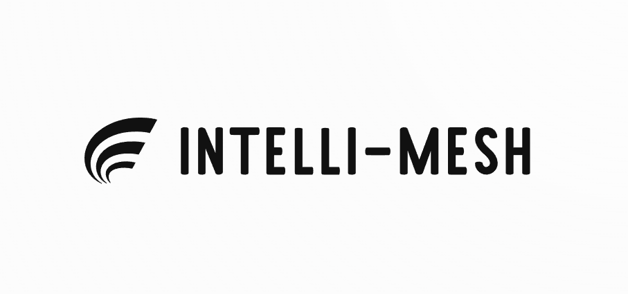
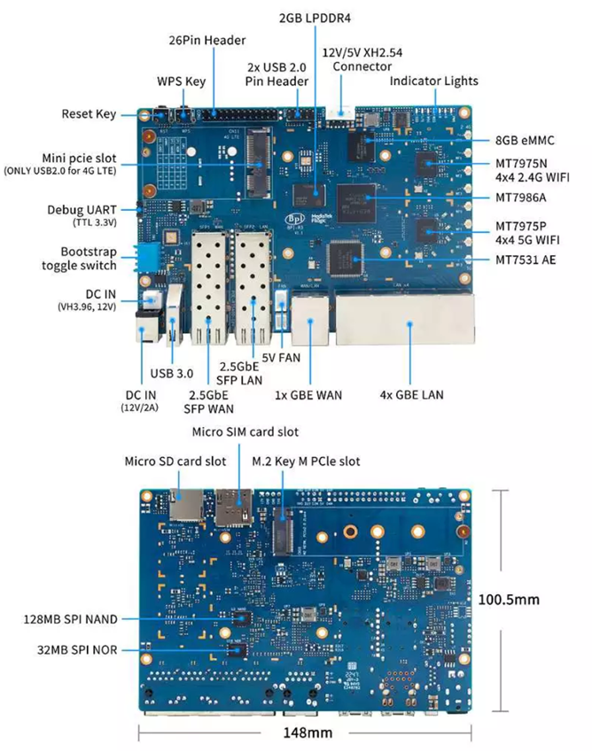
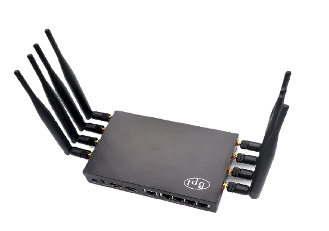
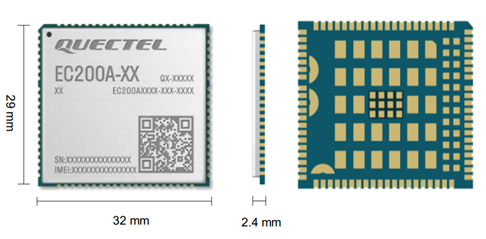
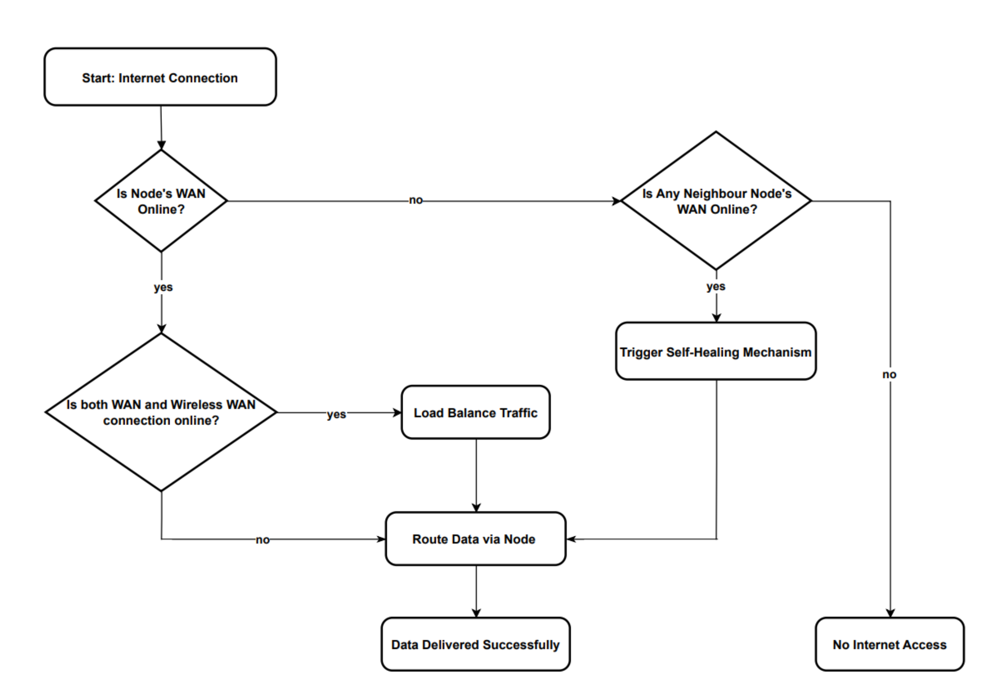
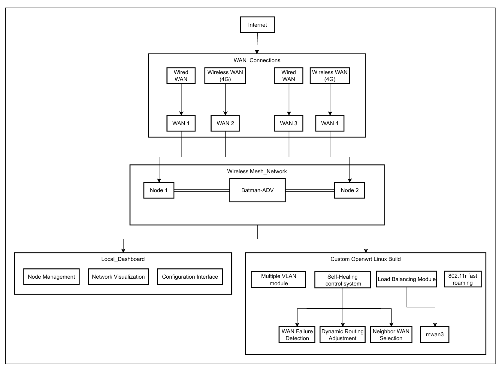
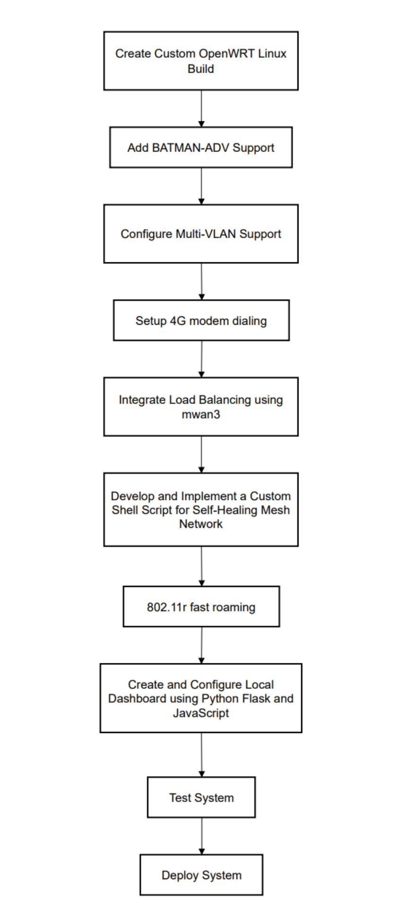

 Intelli-Mesh is an advanced self-healing Multi-WAN wireless mesh network designed for high
 reliability, performance, and scalability, utilizing the BATMAN-ADV routing protocol to en
sure efficient data routing. Built on Banana Pi R3 hardware with a custom OpenWRT build,
 it integrates Multi-WAN capabilities for robust internet connectivity. The self-healing mech
anism, a core innovation, monitors network performance in real-time, dynamically adjusting
 routing paths to mitigate issues and minimize downtime. Multi-WAN support enables auto
matic failover to different connections (e.g., 4G modems), managed by mwan3 for continuous
 internet access and effective load balancing across WAN links. Multi-VLAN support allows
 for network segmentation, separating traffic types like user, management, IoT, and guest traffic, 
 which reduces congestion and enhances performance. A user-friendly dashboard developed
 with Python Flask and JavaScript provides a graphical interface for easy network monitoring
 and management. Designed for environments ranging from small enterprises to rural areas,
 Intelli-Mesh aims to be a cost-effective, reliable, and manageable network solution, contribut
ing valuable insights into self-healing mesh networks and setting a new standard for future
 network infrastructure.

## Introduction

 The Intelli-Mesh project aims to revolutionize the current state of Multi-WAN mesh networks
 by offering a self-healing system that emphasizes high reliability, superior performance, and
 scalable functionality. Leveraging the capabilities of the BATMAN-ADV (Better Approach
 To Mobile Adhoc Networking) routing protocol and utilizing Banana Pi R3 hardware with a
 customized OpenWRT firmware, this innovative solution is designed to address critical issues in
 network stability and efficiency. By incorporating self-healing capabilities, Intelli-Mesh is able
 to detect and automatically resolve network disruptions, minimizing downtime and ensuring
 continuous availability. The system’s load balancing feature optimizes bandwidth usage across
 network nodes, while Multi-VLAN support enhances traffic management, reducing broadcast
 issues and improving overall network efficiency.
 Unlike traditional mesh networks that rely on centralized architectures, wherein a single
 server node is responsible for decision-making and network management, Intelli-Mesh empow
ers every node to function autonomously. This decentralized approach transforms each node
 into an intelligent entity capable of monitoring, managing, and optimizing its performance,
 thereby eliminating the limitations associated with centralized control systems. The project
 seeks to overcome issues such as single points of failure, limited scalability, and inefficient re
source utilization that often plague existing network systems. Intelli-Mesh’s architecture makes
 it suitable for a wide range of applications, from small-scale business networks to expansive ru
ral deployments, providing a flexible and scalable solution to meet varying connectivity needs.
 At the core of its implementation, the system relies on Banana Pi R3 routers equipped with
 customized OpenWRT software, enabling advanced features through BATMAN-ADV routing.
 Additionally, the integration of mwan3 ensures effective load balancing and failover capabili
ties, allowing for the efficient distribution of network traffic and the maintenance of high per
formance even during node failures. Multi-VLAN support, meanwhile, facilitates traffic seg
mentation, contributing to a more organized and streamlined network environment. A locally
 developed dashboard, built using Python Flask and JavaScript, provides users with an intuitive
 interface for monitoring and managing the network, further enhancing the system’s practicality.
 By addressing the inherent limitations of existing mesh network designs, Intelli-Mesh offers
 substantial improvements in terms of fault tolerance, scalability, and overall resilience. Each
 node’s transformation into a ”smart” entity capable of independent decision-making not only
 reduces points of vulnerability but also significantly boosts adaptability and network robust
ness. The Intelli-Mesh project thus represents a comprehensive and cost-effective response to
 contemporary connectivity challenges, ensuring reliable and high-performing network solutions
 for diverse environments.

## Objectives
The primary objective of the Intelli-Mesh project is to revolutionize traditional mesh network
 architectures by transforming each node into a smart, autonomous entity capable of indepen
dently monitoring, managing, and optimizing network performance. Unlike centralized sys
tems, which rely on a single server node, Intelli-Mesh introduces a decentralized self-healing
 network that ensures enhanced resilience, efficiency, and scalability. By incorporating load bal
ancing, Multi-WAN failover, and Multi-VLAN traffic segmentation, the project aims to create
 a robust, adaptive network capable of delivering reliable connectivity, even in challenging or
 high-demand environments. This approach not only minimizes downtime but also maximizes
 resource utilization and reduces performance bottlenecks, paving the way for efficient, uninter
rupted communication.

 Furthermore, the project seeks to develop a user-friendly and scalable solution that meets
 the diverse needs of both small enterprises and large rural networks. Intelli-Mesh empowers ev
ery node within the network to autonomously make intelligent routing and traffic management
 decisions, thereby enhancing fault tolerance and overall network resilience. The custom-built
 local dashboard, leveraging Python Flask and JavaScript, provides users with an intuitive inter
face to monitor and control network activities, ensuring ease of management and accessibility.
 With a focus on decentralization, adaptability, and enhanced network stability, Intelli-Mesh ad
dresses the critical connectivity challenges of modern systems and offers a versatile solution
 suitable for a wide range of applications.

## Hardware
• Banana Pi BPI-R3



The **Banana Pi BPI-R3** is a powerful router board designed for high-performance networking and IoT applications. Its architecture integrates advanced hardware and versatile connectivity options:

1. **Processor and Memory**:
   - Powered by the **MediaTek MT7986 (Filogic 830)** quad-core ARM Cortex-A53 CPU, offering efficient processing for networking tasks.
   - Includes **2GB DDR RAM** and **8GB eMMC storage** (expandable with SD cards), ensuring smooth performance and storage flexibility.

2. **Networking Capabilities**:
   - Equipped with **five Gigabit Ethernet ports**: 1 WAN and 4 LAN, supporting high-speed wired connections.
   - Features dual **M.2 slots** and PCIe support, ideal for adding wireless modules, such as 4G/5G modems or Wi-Fi 6 cards.

3. **Expandable Connectivity**:
   - Includes **USB 3.0** ports for external devices and **UART, GPIO, and I2C pins** for IoT and embedded applications.
   - **Dual SIM card slots** enable seamless LTE/5G connectivity in advanced network setups.

4. **Operating System Support**:
   - Supports **OpenWRT**, Linux distributions, and other custom OS builds, making it highly customizable for routing and edge-computing projects.

5. **Use Cases**:
   - Ideal for mesh networks, IoT gateways, multi-WAN routers, and self-healing network systems.

The BPI-R3's architecture combines robust hardware with rich connectivity, making it a versatile choice for advanced networking and IoT projects like Intelli-Mesh.


## Equipments Used
• Metal case and External antennas for Banana Pi BPI-R3



• Heat-sink for Banana Pi BPI-R3


• 4g Module




## Work-Flow Diagram




## System Architecture

 The system architecture diagram illustrates the components and overall structure of the Intelli
Mesh network. This architecture combines various elements, such as WAN connections, a
 wireless mesh network, and management modules, to create a resilient, autonomous, and self
healing mesh network.  

 • **Internet**: At the top of the architecture is the Internet, which serves as the source of
 external network connectivity. The Intelli-Mesh system can utilize multiple WAN con
nections to connect to the Internet, providing redundancy and load balancing for stable
 connectivity.  
 
 • **WANConnections**:  
 ➣ **WAN1,WAN2,WAN3,WAN4**: The architecture supports multiple WAN (Wide
 Area Network) connections, both wired and wireless (4G). These WAN connections
 act as the gateways to the Internet.  
 ➣ **Wired WAN Connections**: These could be broadband, fiber, or Ethernet-based
 WAN links that provide a stable and high-bandwidth connection to the Internet.  
 ➣ **Wireless WAN (4G) Connections**: These use 4G modems to establish cellular
based connectivity, offering redundancy in case the wired connections fail.  
 ➣ The use of multiple WANs enables load balancing and failover capabilities, ensuring
 that network users experience minimal interruptions even if one or more WAN links
 go down.  
 
 • **Wireless Mesh Network**:  
 ➣ **BATMAN-ADVProtocol**: At the core of the wireless mesh network is the BATMAN
ADV (Better Approach to Mobile Ad-hoc Networking- Advanced) protocol. This
 protocol is specifically designed for mesh networking and allows each node to make
 autonomous decisions based on the network topology. It creates a self-organizing
 and decentralized mesh, where each node can dynamically route data and handle
 network changes effectively.  
 ➣ **Node 1 and Node 2**: These nodes represent the physical devices in the mesh net
work. They are configured with the BATMAN-ADV protocol, allowing them to
 communicate with each other and form a cohesive, resilient network.  
 ➣ Nodes are capable of self-healing, meaning they can detect when a neighbouring node
 or WAN connection is down and adjust routing accordingly to maintain network
 connectivity.  
 ➣ Nodes can act as both transmitters and receivers in the mesh network, supporting
 peer-to-peer communication without relying on a centralized controller.  
 
 • **Local Dashboard**:  
 ➣ The local dashboard is the user interface component of the architecture. It provides
 network administrators with access to various management and monitoring features.
 The local dashboard is typically hosted on a web server and is accessible from within
 the network.  
➣ **Node Management**: Allows administrators to view and manage individual mesh
 nodes. This includes monitoring their status, location, and current connection routes.  
 ➣ **Network Visualization**: Provides a real-time view of the mesh network topology,
 showing how nodes are connected, the status of each link, and any failures or ad
justments made in real-time.  
 ➣ **Configuration Interface**: Offers tools for adjusting network settings, such as load
 balancing parameters, VLAN configurations, and WANpreferences. Administrators
 can also use the configuration interface to set thresholds for failover and specify
 backup routes.  
 
 • **Custom OpenWRTLinuxBuild**:  
 ➣ **Multiple VLAN Module**: Supports multiple Virtual LANs (VLANs) to segment
 network traffic. This enables the creation of isolated network zones for different
 types of traffic, such as administrative, guest, and IoT traffic, enhancing both secu
rity and performance.  
 ➣ **Self-Healing Control System**: This system continuously monitors the health of the
 network. In the event of a failure (e.g., a node goes offline or a WAN connection is
 lost), it triggers automated actions to maintain connectivity.  
 ➣ **WANFailureDetection**: Monitors the status of each WAN connection and detects
 any outages. If a primary WAN link fails, the system automatically switches to a
 backup WAN.  
 ➣ **Dynamic Routing Adjustment**: Alters the routing paths within the mesh network
 based on real-time conditions. If a node fails, routing paths are dynamically adjusted
 to route traffic through other nodes, ensuring data reaches its destination.  
 ➣ **Neighbor WAN Selection**: In a multi-node environment, nodes can select the best
 WAN connection available, even if it belongs to a neighbouring node, to optimize
 overall connectivity.  
 ➣ **Load Balancing Module**: Uses mwan3, a multi-WAN management tool within
 OpenWRT, to distribute traffic across all available WAN links. This prevents any
 single WAN connection from being overwhelmed and optimizes the network per
formance by balancing the load.  
 ➣ **802.11r Fast Roaming**: This protocol allows devices within the mesh network to
 roam seamlessly between nodes with minimal latency. Fast roaming is particularly
 beneficial in environments with mobile devices, as it minimizes connection drops
 when moving between different access points.
 



## Implementation



➣  **Create Custom OpenWRTLinux Build**  
 The project begins with creating a customized version of OpenWRT, an open-source
 Linux-based operating system commonly used on embedded devices and routers. This
 custom build will include the necessary modules and dependencies to support mesh net
working, multi-WAN capabilities, and load-balancing features required by the Intelli
Mesh network.

 ➣ **Add BATMAN-ADVSupport**
 After setting up the OpenWRT base, BATMAN-ADV (Better Approach to Mobile Ad
hoc Networking) support is added. BATMAN-ADV is a routing protocol specifically
 designed for decentralized wireless mesh networks. It allows network nodes to make in
dependent decisions, optimizing routes based on network topology changes. This feature
 is critical for creating a self-healing and resilient mesh network.
 
 ➣ **Configure Multi-VLAN Support** 
 Next, multi-VLAN (Virtual Local Area Network) support is configured to segment the
 network traffic into different VLANs. This step enables the separation of traffic types,
 such as management traffic, guest networks, and IoT devices, enhancing both security
 and traffic management. VLAN segmentation also allows for more efficient bandwidth
 usage and improved quality of service (QoS).
 
 ➣ **Set up 4G Modem Dialling**  
 In this step, the system is configured to handle 4G modem dialling. This setup enables
 WAN redundancy by adding cellular connectivity as a backup option. By using 4G (or
 possibly 5G in future iterations), the network can maintain connectivity even if the pri
mary wired or fiber connection fails. This step ensures that each node has access to
 multiple WAN options, contributing to the system’s reliability.
 
 ➣ **IntegrateLoad Balancing Using mwan3**  
 Load balancing is achieved using mwan3, a multi-WAN manager available in OpenWRT.
 mwan3distributes traffic load across multiple WAN connections, optimizing network per
formance and preventing any single WAN link from being overwhelmed. This feature is
 essential for efficiently managing bandwidth and maintaining high performance, particu
larly in environments with varying internet connectivity options.  

 ➣ **Develop and Implement a Custom Python Script for Self-Healing Mesh Network** 
 A custom Python script is developed and implemented to enable self-healing capabilities
 within the network. This script monitors the status of network nodes and WAN connec
tions in real time. If a node or WAN connection fails, the script automatically re-routes
 traffic and adjusts the mesh topology to maintain connectivity. This self-healing mech
anism is a core component of Intelli-Mesh, enabling automatic recovery from network
 failures.  
 
 ➣ **802.11r Fast Roaming**  
 The 802.11r protocol, known as ”Fast Roaming,” is configured to improve mobility within
 the network. This protocol allows devices to quickly roam between access points with
 minimal latency, which is particularly useful for mobile devices in environments requir
ing seamless connectivity. Fast roaming ensures that devices stay connected without no
ticeable interruptions when they move between different mesh nodes.  

 ➣ **Create Local Dashboard Using JavaScript and Python Flask**  
 A local management dashboard is created using Flask (a lightweight Python web frame
work) and JavaScript. This dashboard provides a user-friendly interface for monitoring
 and managing the network. Key features include real-time visualization of network status,
 traffic distribution, and alerts for network events such as node failures or WAN discon
nections.  

➣ **ConfigureLocal Dashboard**   
 Once the dashboard is built, it is configured to interact with the mesh network. This
 includes setting up real-time data feeds from network nodes and implementing controls
 for users to adjust network parameters (such as load balancing thresholds, node priorities,
 and VLAN settings). The configuration process ensures that the dashboard accurately
 reflects the live network state.
 
 ➣ **Configure Communication Between Hardware and Local Dashboard**  
 In this step, the communication between the hardware (mesh nodes and routers) and the
 local dashboard is established. The MQTT protocol, known for its lightweight nature and
 efficiency in real-time data exchange, may be used here to enable the dashboard to receive
 instant updates from the nodes. This communication link is crucial for the dashboard to
 display accurate, up-to-date network information and for administrators to control the
 network remotely.
 
 ➣ **TestSystem**  
 After the entire system setup, rigorous testing is conducted. Testing includes simulating
 node failures, WAN link disconnections, load balancing, and fast roaming to ensure that
 all components function as expected. The self-healing script, load balancing configura
tion, and dashboard functionalities are also tested for reliability, resilience, and usability.
 This step validates the robustness of the Intelli-Mesh network.
 
 ➣ **DeploySystem**  
 Once the system passes all tests, it is ready for deployment in the intended environment.
 During deployment, final configurations may be made to adapt to specific conditions, such
 as geographic layout or the expected number of network nodes. The deployed system is
 then monitored in real-time through the dashboard, and adjustments are made as needed
 to maintain optimal performance


## Download

Built firmware images are available for many architectures and come with a
package selection to be used as WiFi home router. To quickly find a factory
image usable to migrate from a vendor stock firmware to OpenWrt, try the
*Firmware Selector*.

* [OpenWrt Firmware Selector](https://firmware-selector.openwrt.org/)

If your device is supported, please follow the **Info** link to see install
instructions or consult the support resources listed below.

## 

An advanced user may require additional or specific package. (Toolchain, SDK, ...) For everything else than simple firmware download, try the wiki download page:

* [OpenWrt Wiki Download](https://openwrt.org/downloads)

## Development

To build your own firmware you need a GNU/Linux, BSD or MacOSX system (case
sensitive filesystem required). Cygwin is unsupported because of the lack of a
case sensitive file system.

### Requirements

You need the following tools to compile OpenWrt, the package names vary between
distributions. A complete list with distribution specific packages is found in
the [Build System Setup](https://openwrt.org/docs/guide-developer/build-system/install-buildsystem)
documentation.

```
binutils bzip2 diff find flex gawk gcc-6+ getopt grep install libc-dev libz-dev
make4.1+ perl python3.6+ rsync subversion unzip which
```

### Quickstart

1. Run `./scripts/feeds update -a` to obtain all the latest package definitions
   defined in feeds.conf / feeds.conf.default

2. Run `./scripts/feeds install -a` to install symlinks for all obtained
   packages into package/feeds/

3. Run `make menuconfig` to select your preferred configuration for the
   toolchain, target system & firmware packages.

4. Run `make` to build your firmware. This will download all sources, build the
   cross-compile toolchain and then cross-compile the GNU/Linux kernel & all chosen
   applications for your target system.

### Related Repositories

The main repository uses multiple sub-repositories to manage packages of
different categories. All packages are installed via the OpenWrt package
manager called `opkg`. If you're looking to develop the web interface or port
packages to OpenWrt, please find the fitting repository below.

* [LuCI Web Interface](https://github.com/openwrt/luci): Modern and modular
  interface to control the device via a web browser.

* [OpenWrt Packages](https://github.com/openwrt/packages): Community repository
  of ported packages.

* [OpenWrt Routing](https://github.com/openwrt/routing): Packages specifically
  focused on (mesh) routing.

* [OpenWrt Video](https://github.com/openwrt/video): Packages specifically
  focused on display servers and clients (Xorg and Wayland).

## Support Information

For a list of supported devices see the [OpenWrt Hardware Database](https://openwrt.org/supported_devices)

### Documentation

* [Quick Start Guide](https://openwrt.org/docs/guide-quick-start/start)
* [User Guide](https://openwrt.org/docs/guide-user/start)
* [Developer Documentation](https://openwrt.org/docs/guide-developer/start)
* [Technical Reference](https://openwrt.org/docs/techref/start)

### Support Community

* [Forum](https://forum.openwrt.org): For usage, projects, discussions and hardware advise.
* [Support Chat](https://webchat.oftc.net/#openwrt): Channel `#openwrt` on **oftc.net**.

### Developer Community

* [Bug Reports](https://bugs.openwrt.org): Report bugs in OpenWrt
* [Dev Mailing List](https://lists.openwrt.org/mailman/listinfo/openwrt-devel): Send patches
* [Dev Chat](https://webchat.oftc.net/#openwrt-devel): Channel `#openwrt-devel` on **oftc.net**.

## License

OpenWrt is licensed under GPL-2.0
